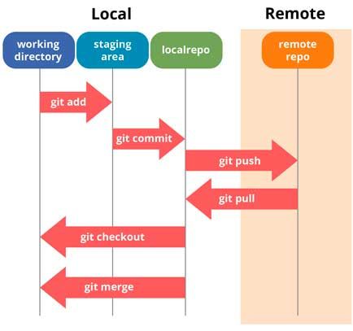

# Clase 01: Git, Github, HTML, CSS

## Git

Git es un software de control de versiones. No es lo mismo que github, git es la herramienta de control de versiones y github es la plataforma que permite hostear tus repositorios en un entorno remoto y colaborar con otros desarroladores.

Cuando modificamos un archivo en nuestro directorio (Working directory) estará disponible para ser movido al Staging Area, que corresponde a los archivos que están listos para ser incluídos en un commit. Una vez definidos los archivos con los cambios que queremos conservar, hacemos un commit para almacenarlos en nuestro repositorio local, es decir, este commit y por ende, ese estado de los archivos en este punto quedarán registrados en la línea de tiempo del repositorio.

### Configuración de Git

`git config --global user.name 'name'`
`git config --global user.email 'name@email.com'`

### Trabajando con git

Inicializar repositorio:
`git init`

Asociar repositorio remoto con el repositorio local:
`git remote add origin https://url.del.repositorio.git`

Ver archivos modificados desde el último commit:
`git status`

Agregar archivos modificados al staging area:
`git add .`
`git add ./ruta/de/archivo.txt`

Crear un commit con los cambios en el staging area:
`git commit -m 'mensaje de commit'`

Subir los cambios (que han sido incluidos en un commit) al repositorio remoto (Github). La opción `-u` es opcional y se usa para establecer esa rama como rama por defecto al hacer `git push` y `git pull`.
`git push origin -u <nombre_rama>`

## HTML

### Search engine optimization (SEO)

SEO es un proceso de optimización que se realiza a los sitios web con el fin de mejorar el posicionamiento en los motores de búsqueda (Google, Bing, DuckDuckGo, etc..). Existen 2 tipos, **SEO pagado** y **SEO orgánico**, el pagado, consiste en pagarle a un motor de búsqueda para posicionar un sitio web en los primeros lugares de los resultados cuando se realizan busquedas determinadas. Por otra parte, el SEO orgánico, consiste en construir el sitio web utilizando distintos recursos que son identificados y premiados por los motores de búsqueda otorgando un buen posicionamiento. Algunos de los factores que influyen en el SEO orgánico son:

- Uso correcto de las etiquetas HTML, como <header, `<nav>`, `<section>`, `<article>`, `<sidebar>`, `<footer>` y encabezados (`<h1>`, `<h2>`, `<h3>`, etc..)
- Utilización de etiquetas meta en el head de la página, como palabras clave.
- Relación entre el título de la página con el contenido de la página.
- Utilización de textos en negrita en palabras clave.
- Vinculos de páginas externas que dirigen hacia el sitio web.
- Uso de atributo `alt` en las imágenes.

### Valor semántico

Las mayoría de las etiquetas HTML tienen un valor semántico, lo que ayuda a entender la función que cumple una etiqueta determinada dentro de la página con el fin de ayudar a los motores de búsqueda y potenciar el SEO, así como para que los navegadores sepan interpretar de mejor manera el comportamiento del sitio web.

Existen 2 etiquetas que no tienen valor semántico, que son la etiqueta `
` y la etiqueta ``, pero que se diferencian en su comportamiento, que es definido por la propiedad CSS `display`.

## CSS

### Box model

En CSS todo elemento se compone de cajas, que tienen distintos comportamiento de acuerdo a las propiedades que tengan asignadas. De esta forma se definen las distintas partes de la caja de la siguiente forma:

**Contenido:** Corresponde al area en donde se muestra el contenido,y su tamaño puede ser especificado por las propiedades `width` y `height`.
**Padding:** Corresponde al espacio que rodea al contenido y su tamaño se define con la propiedad `padding`.
**Border:** El borde envuelve al _contenido_ y al _padding_ y puede ser personalizado con la propiedad `border`.
**Margin:** Rodea a las tres partes anteriores y corresponde al espacio entre el elemento y los elementos que lo rodean. Está definido por la propiedad `margin`.

### Inline vs Block

La propiedad CSS `display` define cómo se comporta un elemento en el sistema de cajas. Existen distintos valores que puede tomar la propiedad `display`, pero hay 2 que son muy usados, que son `inline` y `block`. El resto de los valores disponibles puede ser consultado [aquí](https://www.w3schools.com/CSSref/pr_class_display.asp).

La etiqueta `
` tiene un comportamiento de tipo `block`, lo que significa que el utilizará el 100% del ancho de su contenedor. Además a los elementos de tipo `block` se les puede asignar `width`, `height`, `padding`, `margin` y `border` provocando que los elementos adyacentes sean empujados según corresponda.

Por otra parte, la etiqueta `` tiene un comportamiento de tipo `inline`, implicando que el elemento no usará la totalidad del ancho de su contenedor, si no que se ajustará al ancho de su contenido. Además, las propiedades `width` y `height` no tendrán efecto, las propiedades `padding`, `margin` y `border` en el eje vertical se aplicarán pero, no empujarán a elementos adyacentes, sin embargo, estas propiedades en el eje horizontal tendrán su efecto normal y causarán que los elementos adyacentes sean empujados.

### Inline-block

Existe un tercer tipo de comportamiento llamado `inline-block`, que tiene un comportamiento en un punto medio entre ambas propiedades anteriores. Los elementos con esta propiedad se comportan como un elemento `inline` en el aspecto en que su ancho se adapta al ancho del contenido, pero las propiedades `width` y `height` si tienen efecto y las propiedades `padding`, `margin` y `border` sí empujarán a los elementos adyacentes.

## Unidades relativas

A diferencia de las unidades absolutas como los _pixeles_, existen unidades relativas, que calculan su valor en relación a la medida de otros elementos.

## Recursos

[Markdown](https://www.markdownguide.org/basic-syntax/)
[Google Fonts](https://fonts.google.com/)
[Flexbox](https://css-tricks.com/snippets/css/a-guide-to-flexbox/)
